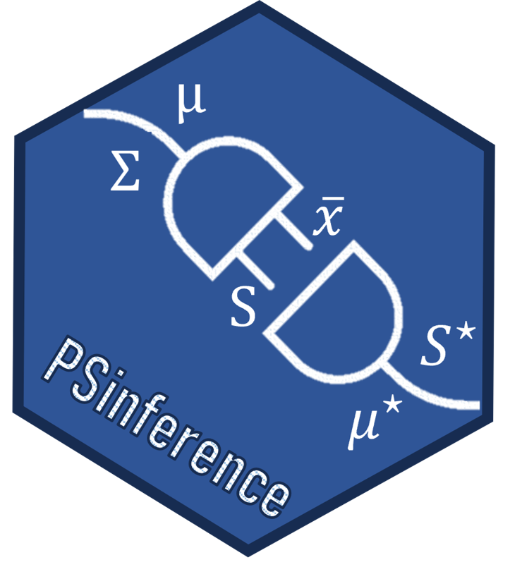

# PSinference 


[](https://github.com/dmazarei/PLSV/actions/workflows/R-CMD-check.yaml)
[](https://cran.r-project.org/package=PSinference)
[](https://cran.r-project.org/package=PSinference)
[](https://cran.r-project.org/package=PSinference)
[](https://www.gnu.org/licenses/gpl-3.0.en.html)

The R package *PSinference* provides inference procedures including the generalized variance, the sphericity test, the test for independence between two subsets of variables, and the test for the regression of one set of variables on the other, when considering the singly imputed synthetic data generated via plug-in sampling under the multivariate normal model. For more details see Klein et al. (2021) 

This work is funded by national funds through the FCT - Fundação para a Ciência e a Tecnologia, I.P., under the scope of the projects UIDB/00297/2020 and UIDP/00297/2020 (Center for Mathematics and Applications)".

## Installation
You can install the **stable** version from
[CRAN](https://cran.r-project.org/package=PSinference).

```s
install.packages('PSinference', dependencies = TRUE)
```

You can install the **development** version from
[Github](https://github.com/ricardomourarpm/PSinference)

```s
# install.packages("remotes")
remotes::install_github("ricardomourarpm/PSinference")
```

## To cite package `PSinference` in publications use:
   Moura R, Norouzirad M, Mazarei D (2023). _PSinference: Inference for Released Plug-in Sampling Single Synthetic Dataset_. R package version 1.0.0,
  <https://cran.r-project.org/package=PSinference>.

A BibTeX entry for LaTeX users is

  @Manual{PSinference,
    title = {PSinference: Inference for Released Plug-in Sampling Single Synthetic Dataset},
    author = {Ricardo Moura and Mina Norouzirad and Danial Mazarei},
    year = {2023},
    note = {R package version 1.0.0},
    url = {https://cran.r-project.org/package=PSinference}
  }

## License

This package is free and open source software, licensed under GPL-3.
